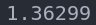

# RMV-Task03

---

### 识别锤子以及 R 标 & 绘制 circle


- 实现思路
  - 先灰度化
  - 在二值化
  - findcontours()
    - 用 **TREE** 型保存父子关系
  - 限制条件
    - 没有父轮廓
    - contourArea()
  - moments()
    - 寻找中心(重心)
  - circle()

### 拟合转速参数

- _time 10.2s_
  
- 实现思路
  - _install ceres_
    ```bash
    wget http://ceres-solver.org/ceres-solver-1.14.0.tar.gz
    ```
    - 需安装一些依赖（略）
    - **_esp. 可能需要修改 eigen 库的路径，不然有可能报错_**
  - 解读 _windmill.cpp & windmill.hpp_
    ==- **_Dicussion_** - （以下的问题均为个人观点） - main.cpp 中存在 start_time 与 now_time 单位不统一的地方，一处除了 1000，一处没有，会造成 windmill.cpp 中传参数时出现与设想不一致的情况，从而导致，在 windmill.hpp 中计算 angle_now 的时候，虽然能“正常”运行，但是会发现 dt 非常大。（所以我擅自在所有文件中修复了一下这个问题） - windmill.hpp 中在计算 angle_now 的时候，后面的两个 if 语句，形同虚设，只有在第一次的时候才会有作用。（故我将其删去） - windmill.hpp 与 windmill.cpp 中定义的 $\phi$ 值也是虚值，其实际上并没有在任何程序中应用，而且理论上的 $\phi$ 值，应该与 windmill.cpp 中所给的不一致。具体应该由 windmill.hpp 中 SumAngle() 函数（通过积分计算当前角度）,通过 $1.81-\frac{\pi}{2}$ 计算得出。（具体的计算方法大致是通过所给的转动速度公式，做定积分，然后将其中的 $\sin()$ 部分通过诱导公式转化成 $\cos()$ ，从而可以通过对比常数，反推出理论上的 $\phi$ 值。应该为 0.24）==
  - 确定锤子 & _“R”_ 的中心点
  - 作差得到向量，再计算其单位向量
    - 此时的 _x_ 分量即为 $\cos(angle_{now})$
  - 构建 _CostFunctor()_
    - 仿函数
    - 模板函数
    - 重载运算符
    - _const_
    - _inline_
    - 四个待确定参数：_A0, A, w, phi_
    - 代入定积分确定 $angle_{now}$
    - 计算理论的 $\cos(angle_{now})$
    - 作差计算残差
  - 构建 _Problem_
  - 添加 _AutoDiffCostFunction_
  - 设置参数边界条件
  - 检查收敛
  - 配置 _Option_
  - _Solver_
  - 计时
    - 初末时刻 _getTickCount()_ 作差
